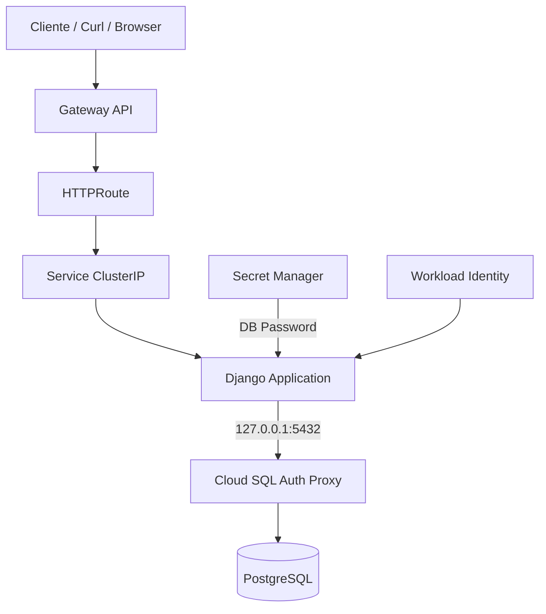

# Challenge Talana – Django App – Challenge Talana
## Tabla de Contenidos
1.  [Descripción General](#descripcion-general)
2.  [Arquitectura de la Aplicación](#arquitectura-de-la-aplicacion)
3.  [Estructura del Proyecto](#estructura-del-proyecto)
4.  [Configuración de la Aplicación](#configuracion-de-la-aplicacion)
5.  [Construcción de la Imagen Docker](#construccion-de-la-imagen-docker)
6.  [Despliegue en Kubernetes](#despliegue-en-kubernetes)
7.  [Conectividad con Cloud SQL](#conectividad-con-cloud-sql)
8.  [Pruebas y Validación](#pruebas-y-validacion)
9.  [Decisiones Técnicas](#decisiones-tecnicas)
10. [Próximos Pasos y Mejoras](#proximos-pasos-y-mejoras)

------------------------------------------------------------------------
## 1. Descripción General
Esta aplicación corresponde a un servicio web desarrollado en Django, desplegado sobre Google Kubernetes Engine (GKE) y expuesto externamente mediante Gateway API.

Características principales:
- Aplicación Django containerizada
- Despliegue en GKE Standard
- Conexión a Cloud SQL PostgreSQL mediante Cloud SQL Auth Proxy
- Secretos gestionados en Secret Manager
- Autenticación sin claves usando Workload Identity
- Imagen almacenada en Artifact Registry

------------------------------------------------------------------------
## 2. Diagrama de Arquitectura

------------------------------------------------------------------------
## 3. Estructura del Proyecto

``` hcl
django/
├── Dockerfile
├── requirements.txt
├── manage.py
├── app/
│   ├── settings.py
│   ├── urls.py
│   ├── views.py
│   └── wsgi.py
└── README.md
```
Los manifiestos Kubernetes se encuentran en el repositorio principal, bajo:
``` hcl
deployment/
├── 03-deployment-django-cloudsql.yaml
├── 04-service.yaml
├── 05-gateway.yaml
└── 06-httproute.yaml
```
------------------------------------------------------------------------
## 4. Configuración de la Aplicación
La aplicación se configura exclusivamente mediante variables de entorno:

| Variable      | Descripción                          |
|---------------|--------------------------------------|
| `DB_NAME`     | Nombre de la base de datos           |
| `DB_USER`     | Usuario de PostgreSQL                |
| `DB_PASSWORD` | Password (inyectado desde Secret)    |
| `DB_HOST`     | `127.0.0.1` (Cloud SQL Proxy)        |
| `DB_PORT`     | `5432`                               |

El secreto ```db-password``` se crea a partir de Secret Manager, sin exponer valores en código ni repositorio.

------------------------------------------------------------------------

## 5. Construcción de la Imagen Docker
Build local
```bash
docker build -t us-east1-docker.pkg.dev/<PROJECT_ID>/apps/django-app:latest .
```
Push a Artifact Registry
```bash
docker push us-east1-docker.pkg.dev/<PROJECT_ID>/apps/django-app:latest
```

La imagen es luego consumida directamente por el Deployment en GKE.

------------------------------------------------------------------------

## 6. Despliegue en Kubernetes

Componentes desplegados:

- Deployment (Django + Cloud SQL Proxy sidecar)
- Service tipo ClusterIP
- Gateway (Gateway API)
- HTTPRoute

El Deployment utiliza:

- Readiness Probe: /readyz
- Liveness Probe: /healthz

------------------------------------------------------------------------

## 7. Conectividad con Cloud SQL

La conexión se realiza usando el patrón sidecar:

- Cloud SQL Auth Proxy corre como contenedor adicional
- Autenticación vía Workload Identity
- Acceso privado mediante Private Service Access
- No se usan IPs públicas ni credenciales estáticas

Esto garantiza:

- Menor superficie de ataque
- Cumplimiento de buenas prácticas de GCP

------------------------------------------------------------------------

## 8. Pruebas y Validación

Prueba interna (port-forward)
```bash
kubectl -n app-talana port-forward svc/django-app-svc 8080:80
curl http://localhost:8080/healthz
```

Respuesta esperada:
```json
{ "status": "ok" }
```

Prueba externa (Gateway API)
```bash
curl http://<GATEWAY_IP>/healthz
```

Verificación de Pods
```bash
kubectl get pods -n app-talana
kubectl logs deploy/django-app -c app -n app-talana
kubectl logs deploy/django-app -c cloud-sql-proxy -n app-talana
```

------------------------------------------------------------------------
## 9. Decisiones Técnicas

- Gateway API en lugar de Ingress clásico (futuro estándar en GKE)
- Cloud SQL Auth Proxy en vez de conexión directa
- Workload Identity para eliminar uso de claves JSON
- Artifact Registry como registry nativo de GCP
- Separación clara entre infraestructura y aplicación

------------------------------------------------------------------------
## 10. Próximos Pasos y Mejoras

- HTTPS con Managed Certificates
- Health checks a nivel de Gateway
- HPA basado en CPU o métricas personalizadas
- Canary / Blue-Green Deployments
- Migraciones automáticas en pipeline
- Observabilidad avanzada (Metrics + Traces)