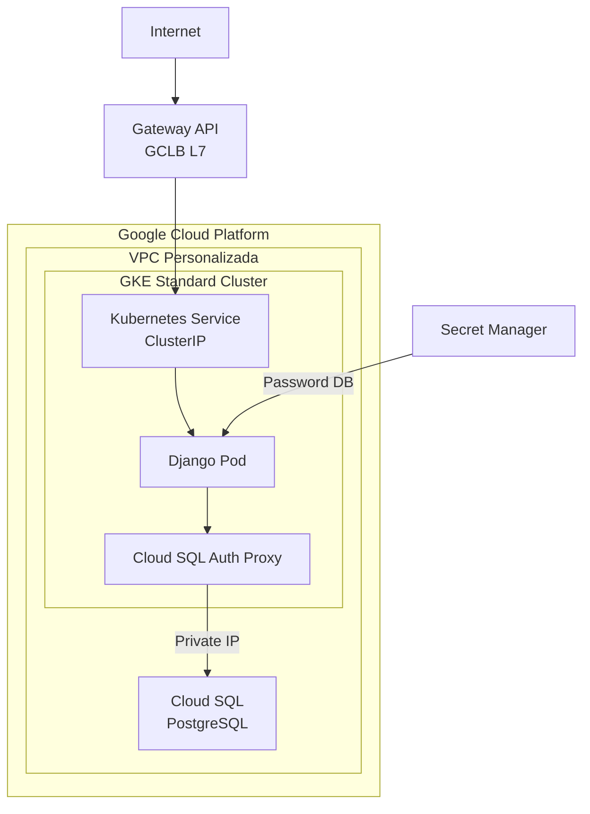

# Challenge Talana – Arquitectura GCP (GKE + Cloud SQL)
## Tabla de Contenidos
1.  [Arquitectura General](#arquitectura-general)
2.  [Diagrama de Arquitectura](#diagrama-de-arquitectura)
3.  [Infraestructura (IaC con
    Terraform)](#infraestructura-iac-con-terraform)
4.  [Base de Datos](#base-de-datos)
5.  [GKE y Workload Identity](#gke-y-workload-identity)
6.  [CI/CD con Github Actions](#ci/cd-con-github-actions)
7.  [Seguridad](#seguridad)
8.  [Terraform State](#terraform-state)
9.  [Despliegue de la Aplicación](#despliegue-de-la-aplicacion)
10. [Conclusiones](#conclusiones)
11. [Próximos Pasos y Mejoras Sugeridas](#próximos-pasos-y-mejoras-sugeridas)
12. [Estructura del Repositorio](#estructura-del-repositorio)
13. [Referencias](#referencias)
------------------------------------------------------------------------
## 1. Arquitectura General
Esta solución implementa una arquitectura moderna en Google Cloud Platform, orientada a buenas prácticas de SRE, seguridad y automatización.\
Incluye:
-   Infraestructura como código con Terraform
-   GKE Standard para la capa de aplicación
-   Cloud SQL PostgreSQL con IP privada
-   Private Service Access (PSA)
-   Gateway API (L7 Load Balancer)
-   Workload Identity (sin llaves JSON)
-   CI/CD con GitHub Actions usando OIDC
-   Gestión segura de secretos con Secret Manager
La aplicación Django se despliega posteriormente sobre GKE, separando claramente infraestructura y aplicación.
------------------------------------------------------------------------
## 2. Diagrama de Arquitectura

------------------------------------------------------------------------
## 3. Infraestructura (IaC con Terraform)
La infraestructura se encuentra ubicada en el directorio infra/.

Incluye:

-   VPC personalizada
-   Subred dedicada para GKE
-   Rangos secundarios para Pods y Services
-   Private Service Access (Service Networking)
-   GKE Standard con Node Pools administrados
-   Cloud SQL PostgreSQL con IP privada
-   Artifact Registry
-   Secret Manager
-   IAM y Service Accounts

Terraform está completamente modularizado, facilitando:
-   Reutilización
-   Mantenibilidad
-   Separación de responsabilidades
-   Destrucción controlada de recursos
------------------------------------------------------------------------
## 4. Base de Datos (Cloud SQL)
Características principales:

-   Motor: PostgreSQL
-   Conectividad solo por IP privada
-   Sin exposición a internet
-   Integración con VPC mediante PSA

Gestión de credenciales:

-   Password generado automáticamente con ```random_password```
-   Almacenado en Secret Manager
-   Nunca expuesto en código ni outputs

------------------------------------------------------------------------

## 5. GKE y Workload Identity

El cluster GKE se despliega en modo Standard.

Características:

-   Node pools configurables
-   Tamaño mínimo estable (```e2-standard-2```)
-   Workload Identity habilitado

Workload Identity permite que:

-   Los Pods usen identidades de GCP
-   No existan llaves JSON
-   Acceso controlado a Cloud SQL y Secret Manager

------------------------------------------------------------------------

## 6. CI/CD con GitHub Actions

La infraestructura se despliega mediante GitHub Actions.

Pipeline:

- Push a main:
    -   terraform ```init```
    -   terraform ```plan```
    -   terraform ```apply```

Autenticación:

-   OIDC (Workload Identity Federation)
-   Sin secretos estáticos
-   GitHub asume un Service Account de Terraform

------------------------------------------------------------------------

## 7. Seguridad

Medidas implementadas:

-   Cloud SQL sin IP pública
-   Acceso privado vía PSA
-   Workload Identity en lugar de llaves
-   Secret Manager para secretos sensibles
-   IAM con principio de mínimo privilegio

------------------------------------------------------------------------

## 8. Terraform State

El state de Terraform se almacena en un bucket GCS.

Ejemplo:
``` hcl
terraform {
  backend "gcs" {
    bucket  = "<project-id>-tfstate"
    prefix = "challenge/infra"
  }
}
```

Beneficios:

-   State compartido
-   Versionado
-   No dependencia del entorno local

------------------------------------------------------------------------
## 9. Despliegue de la Aplicación

La aplicación no se despliega con Terraform.

Motivos:

-   Separación clara entre infraestructura y aplicación
-   Terraform enfocado en recursos de plataforma
-   Kubernetes gestionado mediante manifests (kubectl)

La aplicación:

-   Obtiene secretos desde Secret Manager
-   Se conecta a Cloud SQL vía Auth Proxy
-   Usa Workload Identity

------------------------------------------------------------------------
## 10. Conclusiones

Este proyecto cumple completamente con los requisitos del desafío:

✔ Infraestructura 100% declarativa

✔ GKE Standard

✔ Cloud SQL con IP privada

✔ Seguridad end-to-end

✔ CI/CD con GitHub Actions

✔ Sin llaves JSON

✔ Infraestructura modular

✔ Documentación clara

------------------------------------------------------------------------

## 11. Estructura del Repositorio

``` hcl
infra/
  modules/
    network/
    gke/
    psa/
    cloudsql/
    artifact_registry/
    workload_identity_sa/
  main.tf
  providers.tf
  variables.tf
  terraform.tfvars
  README.md

.github/
  workflows/
    terraform.yml

README.md
```

------------------------------------------------------------------------

## 12. Referencias

### Terraform – Google Provider

https://registry.terraform.io/providers/hashicorp/google/latest/docs

https://registry.terraform.io/providers/hashicorp/google/latest/docs/resources/container_cluster

https://registry.terraform.io/providers/hashicorp/google/latest/docs/resources/sql_database_instance

https://registry.terraform.io/providers/hashicorp/google/latest/docs/resources/service_networking_connection

### Google Cloud

https://cloud.google.com/kubernetes-engine/docs

https://cloud.google.com/sql/docs/postgres

https://cloud.google.com/iam/docs/workload-identity-federation

https://cloud.google.com/secret-manager/docs

------------------------------------------------------------------------